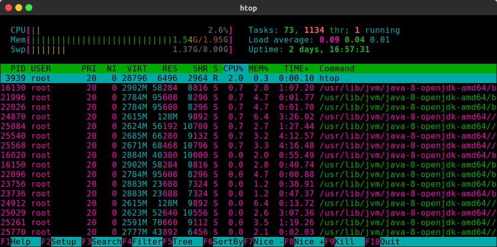

#### 1. 病毒的发现与清除

​	今天登陆自己的服务器发现cpu占用率一直在100%，但自己并没运行任何任务。排查了一下发现sysupdate进程非常奇怪，原以为是阿里云后台的默认更新操作，但是过了一段时间发现这个进程还在运行。于是上网搜了一下才发现这是个挖矿木马程序。


​	参照网上的一些blog，能暂时kill掉木马进程。但是基本上过段时间又会重新启动起来（CSDN上的Blog感觉都是抄来抄去的，看着简直就是浪费时间）。而自己因为刚好安装了很多的环境在机器上，重装系统是不可能重装的。所以对着 **update.sh**这个脚本一步一步排查，并且检测后台异常的进程简单的杀了一下毒，基本上算是解决了这个病毒。

#### 一些基本的操作，网上其他blog也都能找到。

```shell
chattr -i /root/.ssh/authorized_keys
rm -r /root/.ssh/authorized_keys
#实在不行可以直接删除整个 /root/.ssh目录，防止后台的进程继续篡改（cat直接注入公钥）
```

```shell
# /etc/目录下执行
chattr -i sysupdate
rm -f sysupdate 
chattr -i networkservice
rm -f networkservice
chattr -i sysguard
rm -f sysguard
chattr -i update.sh
rm -f update.sh
chattr -i config.json
rm -f config.json
# 删除这些个病毒文件，但是如果仅仅删除这些后台的定时进程又会重新下载，并重启
```

但是删完发现没过多久文件又被下载回来了，用htop观察了一下发现有进程在定期执行/tmp目录下的脚本，里面内容和update一致，于是果断将其删除。（目前还不知道怎么产生的，感觉可能是二进制文件里面写的操作）


然后在附带删除一些定时任务，直接卸载掉或删除cron的二进制文件：

```shell
chattr -R -i /var/spool/cron
rm -r /var/spool/cron
/etc/init.d/cron stop
rm /etc/init.d/cron # 最好直接卸载掉或删除cron的二进制文件
# 如果没有定时间任务直接删除这个cron的执行文件，当然这个好像还创建了不少的其他的定时任务daily month的。我删完也忘了在哪。
```

病毒脚本在执行之初就把wget 和curl的名字改了，并且用他们来执行下载的脚本。为了防止其重新下载，我直接删除了这些个命令。

```shell
mv /usr/bin/wget /usr/bin/get
mv /usr/bin/xget /usr/bin/get
mv /usr/bin/get /usr/bin/wge
mv /usr/bin/curl /usr/bin/url
mv /usr/bin/xurl /usr/bin/url
mv /usr/bin/url /usr/bin/cur
```

服务器恢复正常运行	：



#### 2. 对网络安全的反思

​	其实自己之前一直都觉得Linux由于开源是相对安全的，但是直到自己真正的中了一次病毒以后才深刻的意识到，自己所处的网络环境是多么的危险，还好这次只是自己的服务器中了木马病毒，并未带来什么损失，但也给我敲响了警钟让我意识到自己很多行为真的是非常的不安全。

1.  随便开启服务器的端口，虽然我只是开启了安全组部分的端口，用于登陆还不是图方便开启全部的端口。但这次的入侵我可能就是因为自己开放了Hadoop的一些网络端口，加上Hadoop旧版本存在的一些漏洞导致的。木马病毒通过特定的端口在服务器上注入私钥，然后通过ssh登陆我的服务器，直接攻破了我的root账户。看了一下自己服务器的网络数据传输的流量信息，估计后台上传了一些什么服务器上的信息。很难想象如果服务器上有敏感信息的话会发生什么。
2. 平时使用root账户，虽然自己知道使用root账户是一个非常不好的习惯，但是在自己配服务器的时候，经常是图方便，直接使用root账户来进行所有的操作，这就导致了一旦自己的一些失误导致的漏洞导致的就是自己电脑权限的全部丢失。
3. 使用ssh的免密登陆，之前308的服务器被攻破，很大一个原因就是自己使用了ssh的免密登陆，原以为免密登陆会比密码登陆更为安全和简单。但是经过这次注入事件觉得，ssh的免密登陆最好不要使用。

####　3.木马病毒脚本

​	因为我也只是简单的为了解决问题，才去看的这个脚本。很多功能应该没有写进去，但是对着这个脚本基本上是能解决大部分问题的，如果有小伙伴发现了好玩的东西，想交流一下，欢迎给我发邮件: Me@jackdu.cn

木马脚本链接：

https://paste.ubuntu.com/p/GWtmdhR9SS/