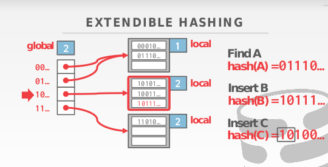
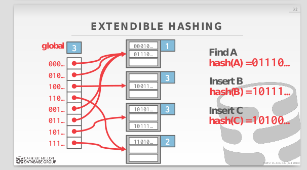
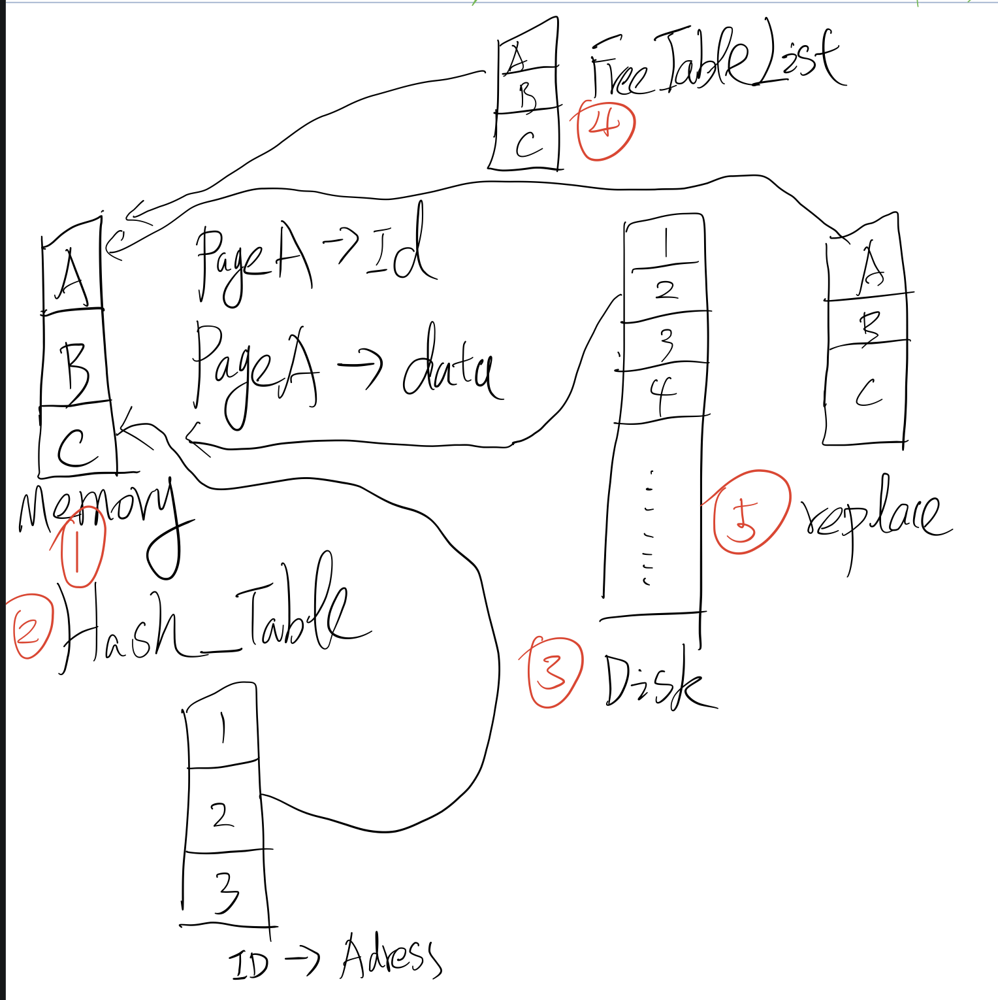

Project 1的主要目的是完成一个数据库的BufferPoolManager，并且将其分为了三小部分完成。首先是完成Extendible Hash Table。其实这部分内容在课程中讲的非常详细(为什么需要EHT,以及EHT的基本原理)，并且实现部分只需要考虑扩容所以其实还算简单。

​	如图所示，在ETH中有个非常巧妙的想法是，通过控制hash值的有效位数来对整个hash表进行扩展和收缩。具体表现为：1. global代表全局的hash值的有效位数，当某个bucket满了以后并且global == local时，通过他来扩大全局索引的大小（翻倍）。2.local表示bucket上hash值的有效位置，当bucket满了以后通过他来redistribute  bucket上值的位置。具体操作为：当某个新插入的值对应的bucket满了以后，1. 如果local == global则需要将global翻倍并redistribute  bucket当中的值直到对应的bucket有足够的空间来容纳新的值。2. 如果local < global，则可以直接redistribute  bucket当中的值并将local++，直到对应的bucket有足够的空间来容纳新的值。

部分实现代码：

~~~c++
template <typename K, typename V>
void ExtendibleHash<K, V>::Insert(const K &key, const V &value) {
  std::lock_guard<std::mutex> guard(mutex);
  int bucketId = getBucketId(key);
  std::shared_ptr<Bucket> bucket = bucketTable[bucketId];
//如果bucket->items.size()一直是满的则需要一直增加hash值的有效位数并且redistribute
  while(bucket->items.size() == bucketMaxSize){
//只有在bucket->localDepth == globalDepth时才需要增加numBuckets以后再redistribute里面的内容，并且在bucketTable扩容的时候，只需要将里面的内容从头到位push_back就可以了（最中会redistribute）
    if(bucket->localDepth == globalDepth){
      int length = bucketTable.size();
      for (int i = 0; i < length; i++){
        bucketTable.push_back(bucketTable[i]);
      }
      globalDepth++;
      numBuckets = numBuckets * 2;
    };
    int mask = 1 << bucket->localDepth;
    auto zeroBucket = std::make_shared<Bucket>(bucket->localDepth + 1);
    auto oneBucket = std::make_shared<Bucket>(bucket->localDepth + 1);
	// 因为bucket上的local++,所以要按照新增位来redistribute里面的内容
    for(auto item : bucket->items){
      if(mask & HashKey(item.first)){
        oneBucket->items.insert(item);
      }
      else{
        zeroBucket->items.insert(item);
      }
    }
    //并且更新hashTable的索引对应的地址
    for (size_t i = 0; i < bucketTable.size(); i++){
      if(bucketTable[i] == bucket){
        if (mask & i){
          bucketTable[i] = oneBucket;
        }
        else{
          bucketTable[i] = zeroBucket;
        }
      }
    }
    bucketId = getBucketId(key);
    bucket = bucketTable[bucketId];
  }
  bucket->items[key] = value;  
}
~~~

第二部分实现一个LRU算法，实现方式多样且简单，在此略过。

第三部分，借助之前实现好的ETH和LRU，来做一个简单的BufferPoolManager，如果能够理解实验代码给出的整体架构事情实现起来也是非常的简单。

如图所示：

整个Buffer Pool Manager分为5个部分，其中disk部分给出的实验代码已经帮你实现好了。内存部分则对应代码中的pages_，一开始就指定好了大小，并且初始化的时候将pages都添加到free_list当中去。而当Fetch Data的时候需要先查看Data在不在Hashtable中，如果在则直接从内存中读取，否则需要先从Disk中读到内存并且将其添加到hashtable中去。通常情况想因为Memory<<Disk所以当内存没满的时候（free_list > 0）可以直接从free_list中获取空闲内存。但是当内存满了以后（free_list == 0）怎需要替换出暂时不用的（Unpinned）的内存空间即从replace中释放新的内存。在释放新的内存的过程中需要考虑内存中的内容是否发生了改变（isdirty），并确定在释放内存之前是否要将里面的内容先回写到磁盘。

部分实现代码：

~~~c++
Page *BufferPoolManager::FetchPage(page_id_t page_id) { 
  std::lock_guard<std::mutex> guard(latch_);
  if (page_id == INVALID_PAGE_ID){
    return nullptr;
  }
  Page *targetPage = nullptr;
//如果page已经在内存中，将pin_count++（表示当前内存被占用不可free），并将targetPage从replace中移除
  if (page_table_->Find(page_id, targetPage)){
    if ( targetPage->pin_count_ == 0){
          replacer_->Erase(targetPage);
    }
    targetPage->pin_count_++;
    return targetPage;
  }else{
//否则找一个可用的内存空间并将page从disk中读入，但是当内存中的空间都被占用时调用失败，返回bullptr      
    targetPage = findUnusedPage();
    if (targetPage == nullptr){
      return nullptr;
    } 
    disk_manager_->ReadPage(page_id,targetPage->GetData());
    targetPage->pin_count_ = 1;
    targetPage->page_id_ = page_id;
    page_table_->Insert(page_id, targetPage);
    return targetPage;
  }
  return nullptr; 
}
// 寻找可用内存空间的过程，在free内存是需要注意脏数据的回写问题
Page *BufferPoolManager::findUnusedPage(){
  Page *unusedPage = nullptr;
  if ( !free_list_->empty() ){
    unusedPage = free_list_->front();
    free_list_->pop_front();
    return unusedPage;
  }else{
    if ( replacer_->Victim(unusedPage) ){
      if (unusedPage->is_dirty_){
        disk_manager_->WritePage(unusedPage->page_id_, unusedPage->GetData());
        unusedPage->is_dirty_ = false;
      } 
      page_table_->Remove(unusedPage->page_id_);
      unusedPage->ResetMemory();
      unusedPage->page_id_ = INVALID_PAGE_ID;
      return unusedPage;
    }
  }
  return nullptr;
}

~~~

实验环境的搭建注意：

博主使用的g++的版本是5，如果用的g++版本过高的话会出现： **-Werror=uninitialized**错误
